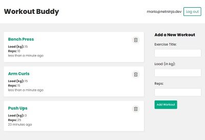

# Workout Buddy

Workout Buddy helps you tracking all the exercises to make your life easier and helthier. If you'd like to check it out, you can access it by [clicking here](https://mern-workout.netlify.app)



## Tech Stack

### Frontend:

- React
- Vite
- React Router
- datefns

### Backend:

- Node.js / Express
- MongoDB
- mongoose

# Installation

Follow these steps to run a local instance:
(You'll need node, npm, and MySQL already installed.)

1. Clone or download this repo

### Set up the backend

2. Install server dependencies:

   Run `pnpm install` from inside the directory:

   ```bash
   $ pnpm install
   ```

3. Start the server
   ```bash
   $ pnpm run dev
   ```

### Set up the frontend

4. Install client dependencies:

   Run `pnpm install` from inside the directory.

   ```bash
   $ pnpm install
   ```

5. Start the React app:
   ```bash
   $ pnpm run dev
   ```
